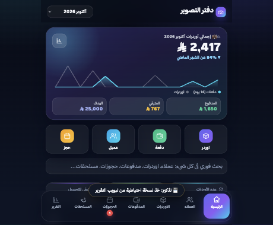
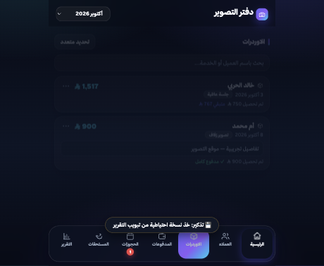
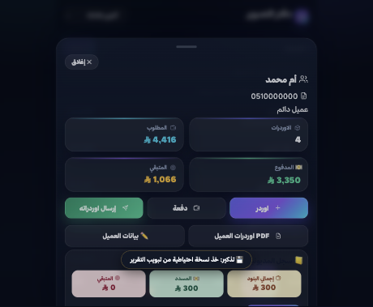
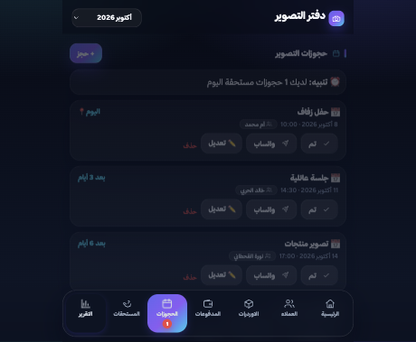
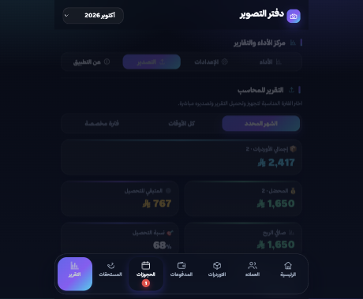
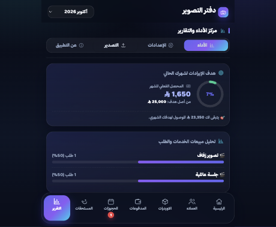

# 📸 دفتر التصوير — حزمة النشر

> تطبيق محاسبة بسيط للمصورين: أوردرات، تحصيل، عملاء، حجوزات، وتقارير.
> يعمل بدون إنترنت · البيانات محفوظة على جهازك فقط · بدون تسجيل ولا خوادم.

**الرابط:** https://wahabansi1-stack.github.io/photographer-app/

---

## 1) رسالة سريعة (أرسلها واتساب لأي زميل مصوّر)

```
تطبيق «دفتر التصوير» —Ledger للمصورين 📸

بدل ما تتابع أوردراتك على دفتر أو بالذاكرة، هذا تطبيق كامل ومجاني:

✅ تسجل الاوردر وتستلم الدفعة ويفرّض «المتبقي» تلقائيًا
✅ بطاقة لكل عميل: أوردراته + مديونيته + فاتور�� PDF
✅ حجوزاتك مع تنبيه على جوالك قبل الموعد بيوم
✅ تقرير لأي فترة ترسله واتساب بضغطة
✅ يشتغل بدون إنترنت، والبيانات كلها على جهازك أنت

الرابط (افتحه وتثبّته من الشاشة الرئيسية):
https://wahabansi1-stack.github.io/photographer-app/

جرّبه أولًا ببيانات تجريبية من: التقرير ← عن التطبيق
```

---

## 2) وصف طويل (للموقع / إنستقرام / لينكدإن)

**دفتر التصوير** —Ledger عربي للمصورين، يشتغل من المتصفح مباشرة بدون تحميل ولا تسجيل.

تسجيل الاوردر، تحصيل الدفعات مع خصم تلقائي من المتبقي، بطاقة عميل كاملة فيها
أوردراته وسجل المديونية وفاتورة PDF، حجوزات مع تنبيهات على الجوال، مستحقات
المصورين، تقارير لكل فترة (شهري / كل الفترات / فترة مخصصة)، وتصدير Excel.

**المميزات التقنية:**
- يعمل **بدون إنترنت** بعد أول فتح.
- البيانات **محليّة على جهازك فقط** — لا خادم، لا حساب، لا تتبّع.
- نسخ احتياطي **يومي داخلي** + نسخة **مشفّرة** اختيارية (AES-256).
- قفل برقم سري، هدف شهري، ومخططات تحليلية.
- واجهة عربية RTL حديثة بخط ثمانية.

---

## 3) لقطات الشاشة

| الرئيسية | الاوردرات | بطاقة العميل |
|---|---|---|
|  |  |  |

| الحجوزات | التقرير | لوحة الأداء |
|---|---|---|
|  |  |  |

---

## 4) خطوات الإرسال للمصورين

1. **ادفع آخر إصدار** من GitHub Desktop (Pull → Push origin) وتأكد أن الرابط يفتح ويعرض الإصدار الجديد.
2. أرسل **الرسالة السريعة** أعلاه في واتساب أو بأي مجموعة مهنية.
3. **المرفق المقترح:** أضف 2–3 لقطات فقط من `screenshots/` (الرئيسية + بطاقة العميل + الحجوزات) — لا ترسلها كلها دفعة واحدة.
4. **اطلب منهم التجربة أولًا:** «من التقرير ← عن التطبيق ← تحميل بيانات تجريبية»، فيجرّب كل شي بدون خوف على بياناته.
5. **ذكّرهم بالتثبيت** (مهم جدًا):
   - **آيفون (سفاري):** مشاركة ← **إضافة إلى الشاشة الرئيسية**. بدونهاSafari قد يمنع حفظ البيانات، ودون إشعارات الحجوزات لا تعمل.
   - **أندرويد (كروم):** ⋮ ← **تثبيت التطبيق**.
6. **ذكّرهم بالنسخ الاحتياطي:** «من التقرير ← التصدير ← نسخة احتياطية» مرة كل أسبوع (أو فعّل التذكير الأسبوعي).

---

## 5) الأسئلة الشائعة (استخدمها للرد على الاعتراضات)

**«أين تُحفظ بياناتي؟ هل أحد يشوفها؟»**
على جهازك أنت فقط (تخزين المتصفح). لا يوجد خادم ولا حساب ولا تتبّع. لا يخرج أي بيان إلا بضغطة منك.

**«لو ضاع جوالي؟»**
النسخة الاحتياطية المصدّرة هي التي تحميك من فقدان الجهاز (الملف أو نسخة مشفّرة ترسلها لنفسك).
اللقطات اليومية داخل التطبيق تحميك من **الخطأ والتلف**، لكن لا تحمي من فقدان الجهاز — لذلك خذ نسخة أسبوعية.

**«هل يعمل بدون إنترنت؟»**
نعم. بعد أول فتح، التطبيق يعمل بالكامل بدون إنترنت، والبيانات تُحفظ محليًا.

**«هل ينفع لأكتر من مصوّر في الفريق؟»**
حاليًا نسخة لكل جهاز — لا توجد مزامنة بين الأجهزة بعد.

**«في فاتورة PDF؟»**
نعم، تُصدَّر من بطاقة العميل أو من كل اوردر، بتصميم رسمي وتُرسل مباشرة.

**«هل هو مجاني؟**
نعم، مجاني بالكامل ولا يطلب أي تسجيل.

---

## 6) ملاحظات داخلية (لا تُنشر)

- الترخيص الحالي للخط ثمانية **شخصي فقط** — الاستخدام بين الزملاء没有问题، لكن أي استخدام تجاري واسع يحتاج مراجعة `font.thmanyah.com/licenses`.
- التطبيق **PWA**: أي تعديل في الكود يظهر مباشرة بدون مراجعة متجر.
- قبل أي تعديل على `app.js` اختبر: إضافة اوردر → تحصيل من بطاقة العميل → حجز → تقرير → فاتورة PDF.